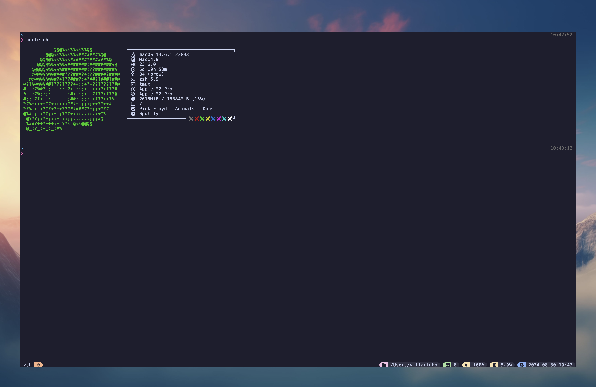

# `~/.dotfiles`

### Tools

- Terminal: [Kitty](https://github.com/lucasvillarinho/dotfiles/tree/main/kitty)
- Window management: [Yabai](https://github.com/lucasvillarinho/dotfiles/tree/main/yabai)
- Prompt: [Starship](https://github.com/lucasvillarinho/dotfiles/tree/main/starship)
- Editor: [VSCode](https://github.com/lucasvillarinho/dotfiles/tree/vscode)

- Terminal Multiplexer: [Tmux](https://github.com/lucasvillarinho/dotfiles/tree/main/tmux)

### Feedback

Suggestions/improvements -> [Issues](https://github.com/lucasvillarinho/dotfiles/issues)

### Tmux

#### Commands

- `prefix + I` ->  Install plugins
- `prefix + |` -> Split the current pane into two, left and right
- `prefix + _` -> Split the current pane into two, top and bottom
- `prefix + \` -> Split current pane full width into two, left and right
- `prefix + _` -> split current pane full height into two, top and bottom

### Author

|  |
|---|
|[Lucas Villarinho](https://www.linkedin.com/in/lucas-villarinho/)|

### license

MIT
